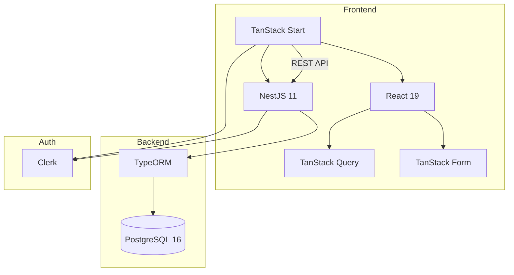

# Architecture

## Vue d'Ensemble du Système



## Stack Technique

| Couche | Technologie |
|--------|-------------|
| Frontend | TanStack Start, React 19, TanStack Router, TanStack Query/Form, Tailwind CSS |
| Backend | NestJS 11, TypeORM, PostgreSQL 16 |
| Auth | Clerk |
| Docs API | Swagger UI |
| Outillage | pnpm workspaces, devenv.sh, TypeScript |

## Structure du Monorepo

```
librestock/
├── modules/
│   ├── api/                 # @librestock/api - Backend NestJS
│   └── web/                 # @librestock/web - Frontend TanStack Start
├── packages/
│   ├── tsconfig/            # Configs TS partagées
│   └── eslint-config/       # Config ESLint partagée
│   └── types/               # Interfaces/enums DTO partagés
├── docs/                    # Documentation MkDocs
├── pnpm-workspace.yaml
├── mkdocs.yml               # Config documentation
└── devenv.nix               # Environnement dev Nix
```

## Flux de Données

```
┌─────────────────────────────────────────┐
│           Frontend TanStack Start       │
│  React Query + clients écrits à la main │
│  DTO partagés via @librestock/types     │
│  Auth Clerk                             │
└─────────────────────────────────────────┘
                    ▼ HTTP/REST
┌─────────────────────────────────────────┐
│            Backend NestJS               │
│  Controller → Service → Repository      │
│  ClerkAuthGuard · TypeORM · Swagger UI  │
└─────────────────────────────────────────┘
                    ▼
┌─────────────────────────────────────────┐
│             PostgreSQL                  │
└─────────────────────────────────────────┘
```

## Flux d'Authentification

```
Utilisateur → Clerk → Token JWT
                        ↓
Frontend: Authorization: Bearer {token}
                        ↓
Backend: ClerkAuthGuard → vérifier → req.auth.userId
```

## Workflow des Types Partagés

Les interfaces/enums DTO partagés sont le contrat entre frontend et backend :

```bash
# 1. Mettre à jour les types partagés
pnpm --filter @librestock/types build
```

!!! warning "Garder les types alignés"
    Assurez-vous que les DTO backend et les hooks frontend correspondent à `packages/types`.

## Patterns Clés

| Pattern | Emplacement | Objectif |
|---------|-------------|----------|
| Repository | `api/src/routes/*/` | Couche d'accès aux données |
| Service | `api/src/routes/*/` | Logique métier |
| BaseAuditEntity | `api/src/common/entities/` | Suppression douce + champs d'audit |
| ClerkAuthGuard | `api/src/common/guards/` | Vérification JWT |
| HATEOAS | `api/src/common/hateoas/` | Liens hypermédia REST |
| DTO partagés | `packages/types/src/` | Contrats backend/frontend |
