# RBI Inventory API - Architecture Diagram

## System Architecture Overview

```mermaid
graph TB
    subgraph Clients["🌐 External Clients"]
        WEB["Web Browser"]
        MOBILE["Mobile App"]
        DESKTOP["Desktop App"]
    end

    subgraph HTTPLayer["🌍 Gin Web Framework"]
        CORS["CORS Middleware<br/>Allow: localhost:3000<br/>Methods: GET,POST,PUT,DELETE"]
        LOGGING["Structured Logging Middleware<br/>GinMiddleware"]
        AUTH["Auth Middleware<br/>Clerk JWT Verification"]
    end

    subgraph Routes["📍 API Routes"]
        HEALTH["GET /health-check"]
        AUTH_ROUTE["POST /api/v1/auth/*<br/>Login, Register, Verify"]
        USERS_ROUTE["GET/POST/PUT/DELETE /api/v1/users/*<br/>User Management"]
        CATS_ROUTE["GET/POST/PUT/DELETE /api/v1/categories/*<br/>Category Management"]
        PRODUCTS_ROUTE["GET/POST/PUT/DELETE /api/v1/products/*<br/>Product Management"]
    end

    subgraph Handlers["🎯 HTTP Handler Layer"]
        AUTH_H["AuthHandler<br/>• Login<br/>• Register<br/>• VerifyToken"]
        USERS_H["UsersHandler<br/>• List Users<br/>• Get User<br/>• Create/Update/Delete"]
        CATS_H["CategoriesHandler<br/>• List Categories<br/>• Get Category<br/>• Create/Update/Delete"]
        PRODUCTS_H["ProductsHandler<br/>• List Products<br/>• Get Product<br/>• Create/Update/Delete"]
    end

    subgraph BizLayer["🧠 Business Logic Layer"]
        AUTH_SVC["AuthService<br/>• Login<br/>• Register<br/>• VerifyToken<br/>• RefreshToken"]
        USERS_SVC["UsersService<br/>• List<br/>• GetByID<br/>• Create<br/>• Update<br/>• Delete"]
        CATS_SVC["CategoriesService<br/>• List<br/>• GetByID<br/>• Create<br/>• Update<br/>• Delete"]
        PRODUCTS_SVC["ProductsService<br/>• List Products<br/>• GetByID<br/>• Create<br/>• Update<br/>• Delete<br/>• GetBySKU"]
    end

    subgraph RepositoryLayer["🗄️ Repository Layer"]
        USER_REPO["UserRepository<br/>• FindAll<br/>• FindByID<br/>• FindByEmail<br/>• Create<br/>• Update<br/>• Delete"]
        CATS_REPO["CategoryRepository<br/>• FindAll<br/>• FindByID<br/>• Create<br/>• Update<br/>• Delete<br/>• GetHierarchy"]
        PRODUCTS_REPO["ProductRepository<br/>• FindAll<br/>• FindByID<br/>• FindBySKU<br/>• Create<br/>• Update<br/>• Delete"]
    end

    subgraph Database["💾 PostgreSQL Database"]
        USERS_TABLE["users<br/>System users & auth"]
        CLIENTS_TABLE["clients<br/>Customer data"]
        CATS_TABLE["categories<br/>Product categories"]
        BRANDS_TABLE["brands<br/>Product brands"]
        SUPPLIERS_TABLE["suppliers<br/>Supplier info"]
        PRODUCTS_TABLE["product_catalog<br/>Products"]
        PHOTOS_TABLE["photos<br/>Product photos"]
        SUPPLIER_PRODUCTS["supplier_products<br/>S-P relationships"]
        LOCATIONS_TABLE["locations<br/>Warehouses"]
        INVENTORY_TABLE["inventory<br/>Stock levels"]
        ORDERS_TABLE["orders<br/>Customer orders"]
        ORDER_ITEMS["order_items<br/>Order lines"]
        MOVEMENTS_TABLE["stock_movements<br/>Movement history"]
        AUDIT_TABLE["audit_logs<br/>Change audit trail"]
    end

    subgraph Config["⚙️ Configuration"]
        ENV["Environment Variables<br/>• DATABASE_URL<br/>• PORT (8080)<br/>• CLERK_SECRET_KEY<br/>• LOG_LEVEL"]
    end

    %% Client to HTTP Layer
    Clients -->|HTTP/REST| HTTPLayer

    %% HTTP Layer flow
    HTTPLayer --> CORS
    HTTPLayer --> LOGGING
    HTTPLayer --> AUTH

    %% HTTP Layer to Routes
    CORS --> HEALTH
    AUTH --> AUTH_ROUTE
    AUTH --> USERS_ROUTE
    AUTH --> CATS_ROUTE
    AUTH --> PRODUCTS_ROUTE

    %% Routes to Handlers
    AUTH_ROUTE --> AUTH_H
    USERS_ROUTE --> USERS_H
    CATS_ROUTE --> CATS_H
    PRODUCTS_ROUTE --> PRODUCTS_H

    %% Handlers to Services
    AUTH_H --> AUTH_SVC
    USERS_H --> USERS_SVC
    CATS_H --> CATS_SVC
    PRODUCTS_H --> PRODUCTS_SVC

    %% Services to Repositories
    AUTH_SVC --> USER_REPO
    USERS_SVC --> USER_REPO
    CATS_SVC --> CATS_REPO
    PRODUCTS_SVC --> PRODUCTS_REPO
    PRODUCTS_SVC --> CATS_REPO

    %% Repositories to Database
    USER_REPO --> USERS_TABLE
    USER_REPO --> CLIENTS_TABLE
    CATS_REPO --> CATS_TABLE
    PRODUCTS_REPO --> PRODUCTS_TABLE
    PRODUCTS_REPO --> SUPPLIERS_TABLE
    PRODUCTS_REPO --> BRANDS_TABLE
    PRODUCTS_REPO --> SUPPLIER_PRODUCTS
    PRODUCTS_REPO --> PHOTOS_TABLE

    %% Config to all layers
    Config -.->|Injected| HTTPLayer
    Config -.->|Injected| Handlers
    Config -.->|Injected| BizLayer
    Config -.->|Injected| RepositoryLayer

    style Clients fill:#e1f5ff
    style HTTPLayer fill:#fff3e0
    style Routes fill:#fff9c4
    style Handlers fill:#f3e5f5
    style BizLayer fill:#e8f5e9
    style RepositoryLayer fill:#fce4ec
    style Database fill:#eceff1
    style Config fill:#f1f8e9
```

## Layer Responsibilities

```mermaid
graph LR
    subgraph HL["🎯 Handler Layer"]
        H1["✓ HTTP Request Validation<br/>✓ DTO Mapping<br/>✓ Response Formatting<br/>✓ Status Code Selection<br/>✓ Error Translation"]
    end

    subgraph BL["🧠 Business Layer"]
        B1["✓ Domain Logic<br/>✓ Business Rules<br/>✓ Data Orchestration<br/>✓ Cross-repo Operations<br/>✓ Domain Errors"]
    end

    subgraph RL["🗄️ Repository Layer"]
        R1["✓ Data Persistence<br/>✓ Query Execution<br/>✓ ORM Abstraction<br/>✓ Transaction Mgmt<br/>✓ Query Optimization"]
    end

    HL -->|Validates & Maps| BL
    BL -->|Uses Interfaces| RL
    RL -->|Returns Data| BL
    BL -->|Returns Domain Objects| HL

    style HL fill:#f3e5f5
    style BL fill:#e8f5e9
    style RL fill:#fce4ec
```

## Data Flow Example: Create Product

## Dependency Injection Flow

## Architecture Layers Detail

## Database Schema Overview

## Error Handling Flow

## Technology Stack

## API Endpoint Structure

